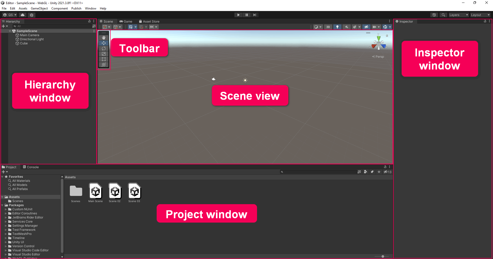

# Explore the Unity Editor

page ref: https://learn.unity.com/tutorial/explore-the-unity-editor-1#6273f00fedbc2a7f158cc1ed

## Unity Editor Interface

- The **Hierarchy Window** is where you can organize all the things in your project. These things are called **GameObjects**.

- The **Project window** is where you can find all the files(assets) available for use in your project, whether you use them or not. The Project window works like a file explorer, organized in folders. You can drag assets directly from the Project window into Scene view to add them to the scene.

- **Note the difference between the Project Window and Hierarhy Window** : the Hierarchy contains all the Gameobjects in the current scene, and the Project window containes all the assets available to your entire project.

- The **Inspector window** is where you will find and configure detailed information about GameObjects. When you select a GameObject in Scene view or in the Hierarchy, you will se its **components** in the Inspector.

- The scene navigation functions are hosted in a floating toolbar in your scene view. These functions allow you to move, rotate and scale your selected GameObjects.
